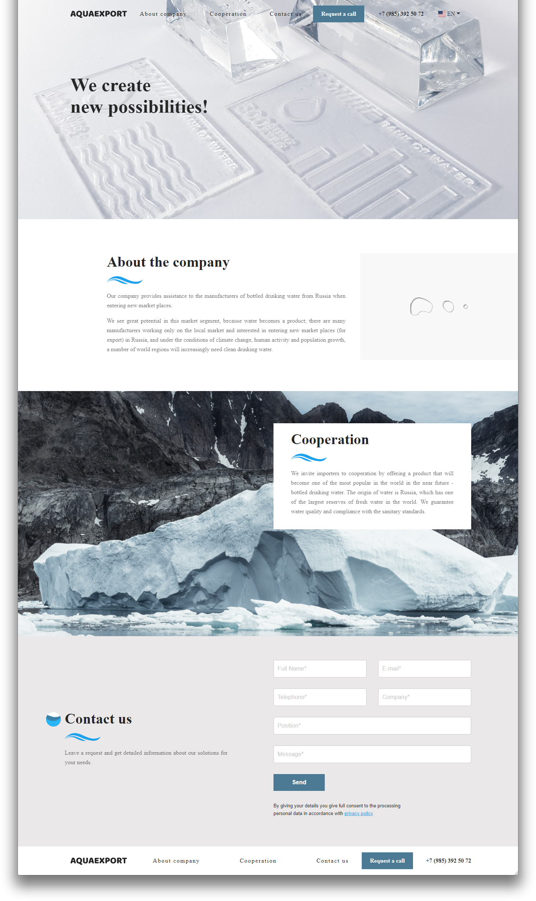

# Личный проект "AquaExport"

<table>
  <thead>
    <tr>
      <th>Команда</th>
      <th>Результат</th>
    </tr>
  </thead>
  <tbody>
    <tr>
      <td width="30%"><code>npm i</code></td>
      <td>Установить зависимости</td>
    </tr>
    <tr>
      <td><code>gulp watch</code></td>
      <td>Запустить сервер и слежение за файлами</td>
    </tr>
  </tbody>
</table>

## Превью сайта

